# react-markdown-template
This a customized implementation of markdown renderer utilizing remark plugins, rehype plugins and pyodide in react framework.


# Purpose of this template

I was planning to build my own wiki page that hosts privately. My goal was to have sort of Python code blocks and render the output under the code block. There are several approaches including but not limited to building a HEXO plugin to render the output or building a customized react app that I can have full control of the design.

To extend the idea of rendering markdown files in React which may be useful in some cases in general while no existing template is available for this, this project has been produced.

This project was built on Vite and Reactjs. The page was decorated with Tailwind CSS and Daisyui.

# Live Demo
The under-developing demo is hosted on Google Firebase and can be accessed here [https://siraisinotes-demo.web.app/](https://siraisinotes-demo.web.app/)

- [x] Frontpage [https://siraisinotes-demo.web.app/](https://siraisinotes-demo.web.app/)
- [x] Markdown render samples [https://siraisinotes-demo.web.app/test](https://siraisinotes-demo.web.app/test)
- [x] Page from markdown files [https://siraisinotes-demo.web.app/coding_notes/algorithm_c](https://siraisinotes-demo.web.app/coding_notes/algorithm_c) and [https://siraisinotes-demo.web.app/coding_notes/python](https://siraisinotes-demo.web.app/coding_notes/python)
- [x] Index page for markdown pages [https://siraisinotes-demo.web.app/notes](https://siraisinotes-demo.web.app/notes)


# Supported features

- ✅ Dark theme, Light theme and follow OS theme switch
- ✅ Read markdown files
- ✅ Render markdown (see the render results)
- ✅ Modularise markdown test page into react components
  - ✅ Markdown renderer
  - ✅ Theme switch in the navigation bar
- ✅ Code block execution
  - ✅ Python code block (Pyodide)
  - ✅ CPP code block
- ✅ Generate page depending on markdown file name
- ✅ Index page for listing all markdown files

<!-- <br> -->
<!-- - ⚠️  -->

<br>


- 🚧 General Pages components
  - 🚧 Nav_bar
  - 🚧 Footer
  - 🚧 Tool manual
  - 🚧 Markdown page 
  - 🚧 Frontpage


<br>

- 💭 Enhance code block render (Render once and add corresponding CSS)
- 💭 Upgrade Mermaid plugin
- 💭 Image processing using Sharp js


## Legend
| ✅ | ⚠️ | 🚧 |💭|
|:---:|:---:|:---:|:---:|
| Done  | Buggy  |  Working on | Brief Idea |

## Notes
### Markdown file structure

This template aimed to build an automatically constructed wiki-liked react app. To achieve this, the routing was based on file structure within `./src` folder. By default, `react-route-dom` will create routes within `Notes` folder excluding `markdownCheatsheet.md` file.

```md
.
├── Notes
│   ├── coding_notes
│   │   ├── algorithm_c.md      <- become `<base url>/coding_notes/algorithm_c`
│   │   └── python.md           <- become `<base url>/coding_notes/python`
│   └── markdownCheatsheet.md
├── page
├── utils
...
```

The filtering behavior was defined in `App.jsx` file which can be customized.

### CPP code block 
The implementation of CPP worker (`src/utils/cpp_worker`) was adopted from [https://github.com/InfiniteXyy/playcode](https://github.com/InfiniteXyy/playcode).


# Render results

<details>
  <summary>Contents (table of content)</summary>
    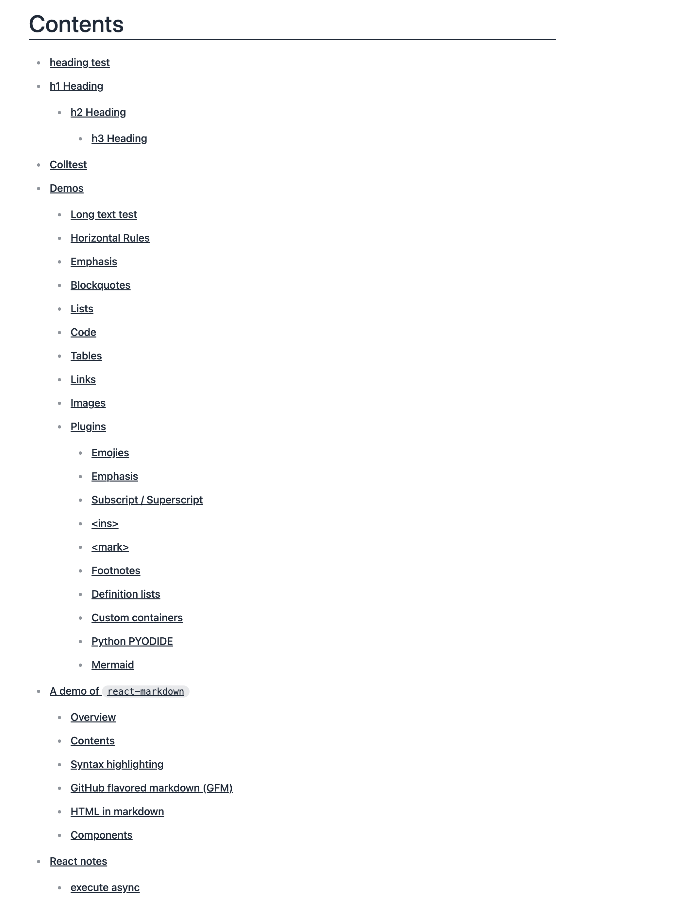
</details>

<details>
  <summary>Github style collapse</summary>
    
</details>

<details>
  <summary>Long text render sample</summary>
      
</details>

<details>
  <summary>Horizonal rules</summary>
      
</details>

<details>
  <summary>Emphasis</summary>
      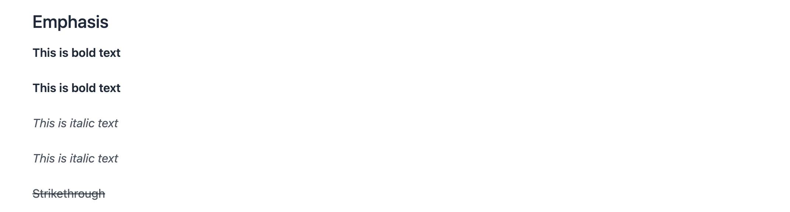
</details>

<details>
  <summary>Blockquotes</summary>
      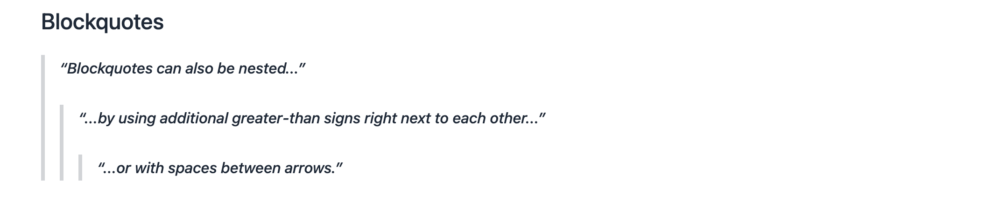
</details>

<details>
  <summary>Lists</summary>
      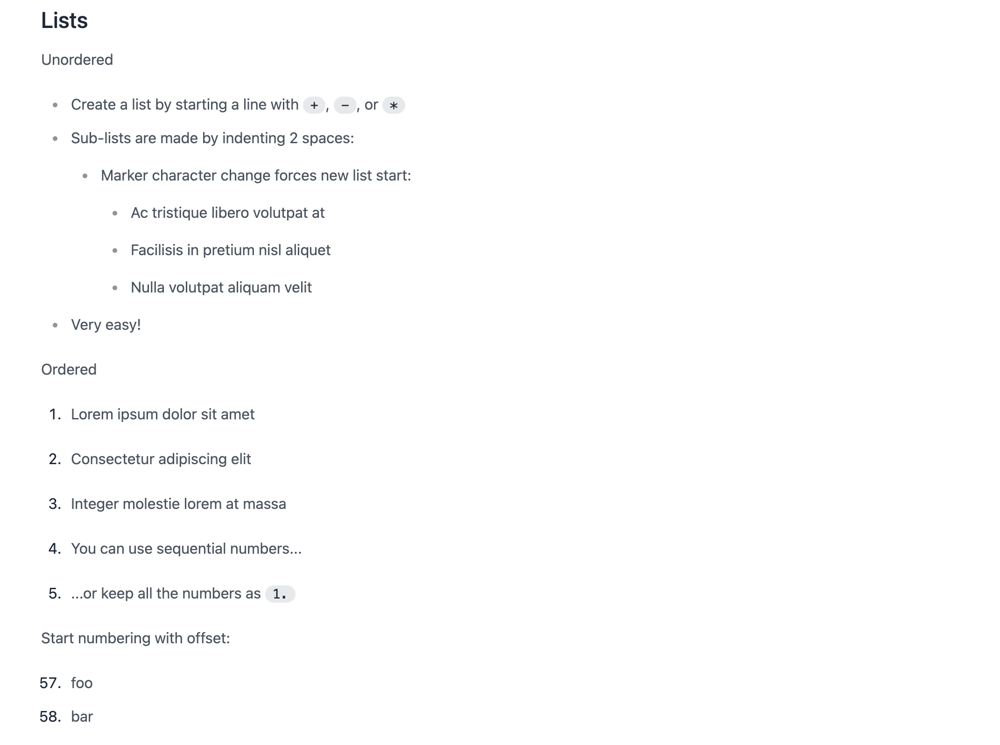
</details>

<details>
  <summary>Code blocks</summary>
      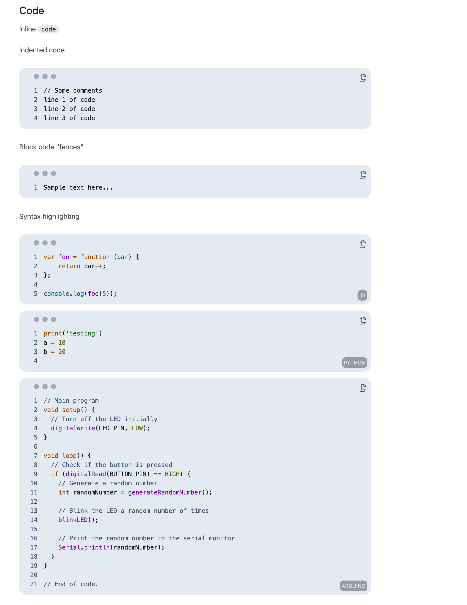
</details>

<details>
  <summary>Tables</summary>
      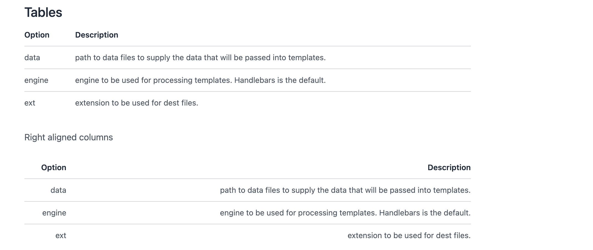
</details>

<details>
  <summary>Links</summary>
      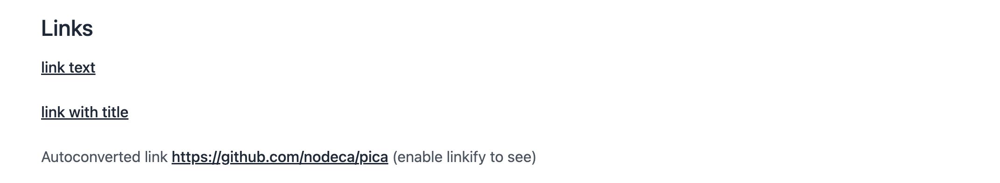
</details>

<details>
  <summary>Images</summary>
      
</details>

<details>
  <summary>Plugins (emojies, emphasis, subscript and superscript, ins and mark)</summary>
      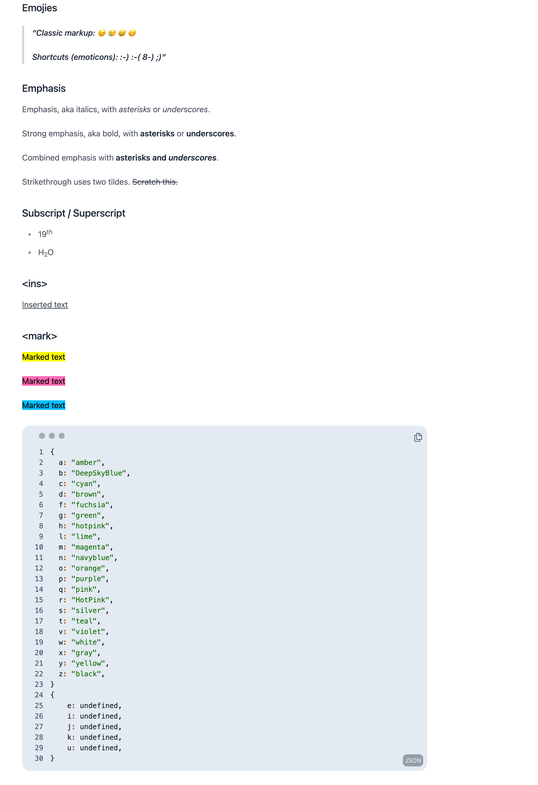
</details>

<details>
  <summary>Footnotes</summary>
      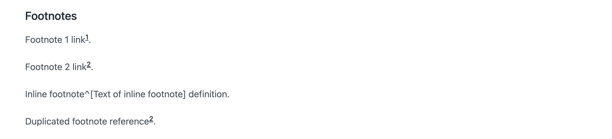
</details>

<details>
  <summary>Definition lists</summary>
      
</details>

<details>
  <summary>Custom containers</summary>
    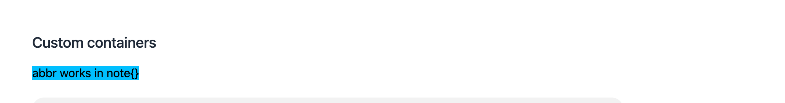
    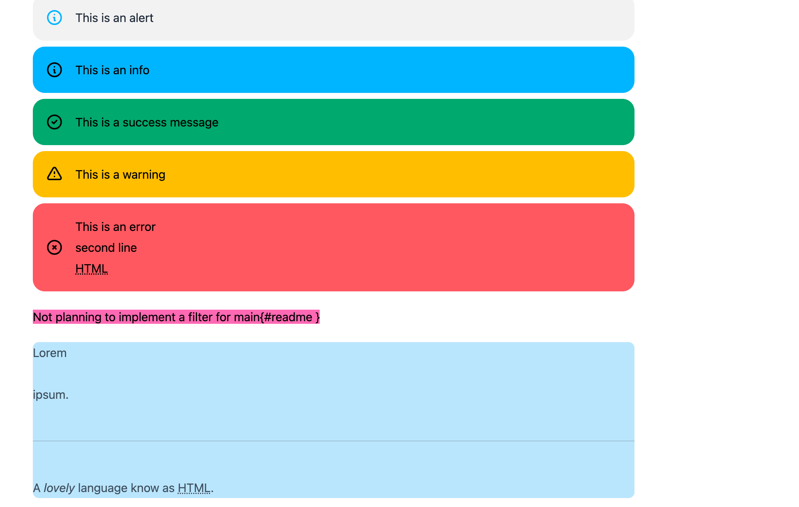
</details>

<details>
  <summary>Python wrap</summary>
      
</details>

<!-- <details>
  <summary>Python Pyodide</summary>
      
</details> -->

<details>
  <summary>Mermaid</summary>
      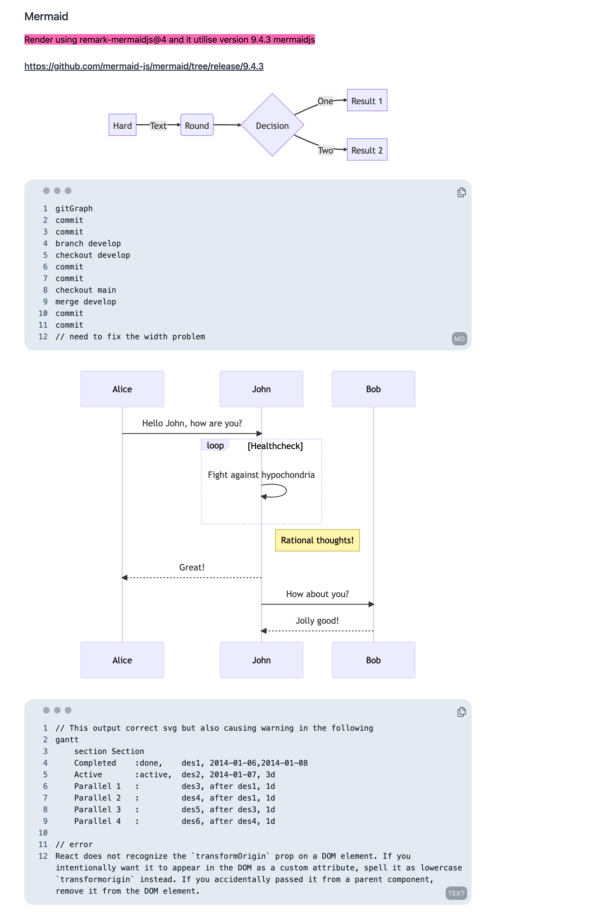
      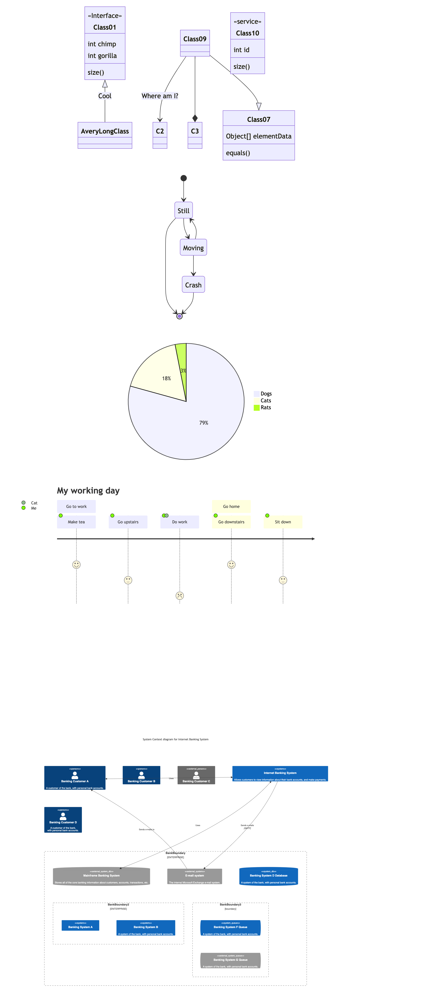
</details>
<details>
  <summary>GitHub flavored markdown (GFM) and HTML</summary>
      
</details>


# Usage
## Build local server

```sh
git clone https://github.com/siraisisatoru/react-markdown-template.git
cd react-markdown-template
npm i
npm run dev
```
Access the demo via link [http://localhost:5173/test](http://localhost:5173/test)


## Deploy to Firebase

```sh
firebase login
npm install -g firebase-tools
firebase init
>? Which Firebase features do you want to set up for this directory? Press Space to select
features, then Enter to confirm your choices. Hosting: Configure files for Firebase Hosting and
(optionally) set up GitHub Action deploys
>? Please select an option: Use an existing project
>? Select a default Firebase project for this directory: <YOUR PROJECT> (<YOUR PROJECT>)
>? What do you want to use as your public directory? dist
>? Configure as a single-page app (rewrite all urls to /index.html)? No
>? Set up automatic builds and deploys with GitHub? No
>? File dist/index.html already exists. Overwrite? No
```


# Contributing

Any new ideas want to add to the project are welcome. Please submit a pull request or open up an issue and we can discuss further.

# License

This project is licensed under the MIT License.
